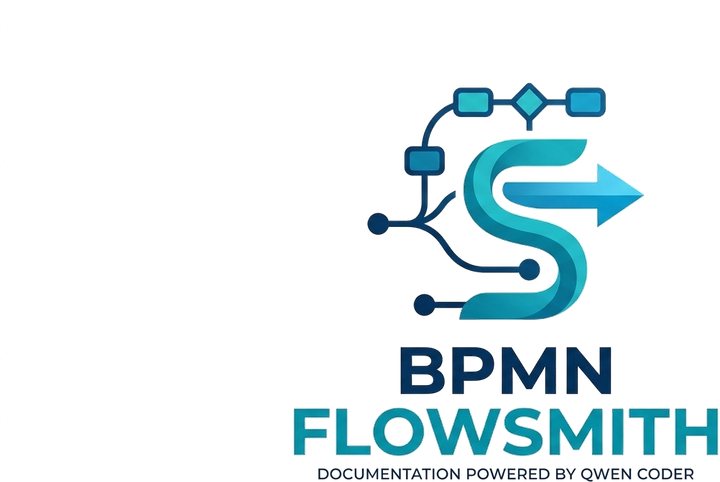
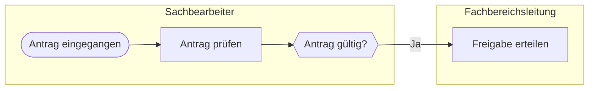

<div align="center">
  

  # BPMN FlowSmith

  **Prompt-to-diagram workflow for BPMN 2.0** — paste a JSON process definition, get an auto-laid-out, fully editable BPMN canvas, export it as `.bpmn`.

  [bpmn-js](https://github.com/bpmn-io/bpmn-js) · [bpmn-moddle](https://github.com/bpmn-io/bpmn-moddle) · [bpmn-auto-layout](https://github.com/bpmn-io/bpmn-auto-layout) · [Next.js](https://nextjs.org)
</div>

---

A plain-text process description goes in, a real BPMN 2.0 diagram comes out. FlowSmith generates the
XML from JSON, runs an automatic layout on it and hands the result to a full bpmn-js modeler, so every
element can still be moved, renamed, extended or deleted before you export.

## Features

- **JSON → BPMN** — validated process definitions are converted to BPMN 2.0 XML with `bpmn-moddle`.
- **Automatic layout** — `bpmn-auto-layout` computes coordinates and routes sequence-flow waypoints.
- **Editable canvas** — the full bpmn-js palette, context pad, drag & drop, direct labeling and undo.
- **Fullscreen editing** — expand the diagram to the whole viewport, `Esc` exits again.
- **Import & export** — read existing `.bpmn`/`.xml` files, download the current canvas as `.bpmn`.
- **Auto-layout on import** — files without layout information (`BPMNDiagram` DI) are laid out first.
- **No page scrolling** — the app is bound to the viewport height; only the editor and side panel scroll.
- **Strict output prompt** — one click copies the system prompt for LLMs that emit the JSON schema.
- **English or German labels** — the **Output language** selector decides which language the prompt asks the
  LLM to write labels, lane names, and edge conditions in. The choice is stored in `localStorage` and applies
  to the next copy, the rule wording, and the example JSON.
- **Dark mode** — follows `prefers-color-scheme`.

## Getting started

Requirements: **Node.js >= 20.9** (Next.js 16) and npm.

```bash
npm install
npm run dev
```

Open [http://localhost:3000](http://localhost:3000).

| Script            | Description                              |
| ----------------- | ---------------------------------------- |
| `npm run dev`     | Start the dev server (Turbopack)          |
| `npm run build`   | Production build                         |
| `npm run start`   | Serve the production build               |
| `npm run lint`    | ESLint                                   |
| `npx tsc --noEmit`| Type check                               |

## Workflow

1. Pick the **Output language** next to the button (English by default, remembered in `localStorage`).
2. Click **Copy Prompt** and paste it into your LLM together with a process description.
3. Paste the returned JSON into the **Process definition (JSON)** editor.
4. Click **Generate & Edit Diagram** (or press `Ctrl`/`⌘` + `Enter`).
5. Refine the result on the canvas, optionally in fullscreen.
6. Click **Export .bpmn**, **Export .xml**, **Export PNG**, **Export SVG** or **Export Mermaid** to
   download the current state of the canvas. **Copy Markdown** copies the Mermaid code in a fenced block
   for GitHub or GitLab.

## Input schema

Every `id` (`processId`, lanes, nodes, edges) must start with a letter or underscore and may otherwise
contain letters, digits, `_`, `-`, and `.`. `bpmn-auto-layout` indexes elements by id and cannot resolve
an id that starts with a digit — it fails with `Cannot read properties of undefined (reading 'di')`, so
the app rejects such ids up front with a readable message.

```jsonc
{
  "processId": "Process_Antragspruefung",   // required, non-empty string
  "processName": "Antragsprüfung",          // optional
  "lanes": [                                // optional, ids must be unique
    { "id": "lane_1", "name": "Sachbearbeiter" },
    { "id": "lane_2", "name": "Bestellsystem" }
  ],
  "nodes": [                                // required, at least one, ids must be unique
    {
      "id": "task_1",                       // required
      "type": "userTask",                   // required, see below
      "label": "Antrag prüfen",             // optional, becomes the element name
      "laneId": "lane_1"                    // optional, must reference an existing lane
    }
  ],
  "edges": [                                // optional, ids must be unique
    {
      "id": "e1",                           // required
      "sourceId": "start_1",                // required, must reference an existing node
      "targetId": "task_1",                 // required, must reference an existing node
      "condition": "Ja"                     // optional, becomes the sequence flow name
    }
  ],
  "dataAssociations": [                    // optional, ids must be unique
    {
      "id": "da1",                         // required
      "nodeId": "task_1",                  // required, must reference an activity
      "dataNodeId": "store_1",             // required, must reference a data node
      "direction": "read"                  // required, "read" or "write"
    }
  ]
}
```

### Step depth and granularity

The schema cannot tell you whether a diagram is superficial — one node named `Create order` next to another
named `Send invoice` passes every validation rule and still says nothing. Depth therefore lives in the
prompt (section 3d), which forces the model to read method bodies rather than method names:

- one node is **one concrete action with one clear outcome** — if the label needs the word "and", it is two nodes
- each of these forces a node of its own: every **status/state transition**, every **persisting write**
  (`save`, `insert`, `update`, transaction commit), every call that **crosses a system boundary** (HTTP/RPC,
  queue publish, mail send, file transfer), every **human wait** (approval, review, handoff), every **async
  continuation** (scheduled job, queue consumer, callback), and every **iteration** doing real work per item
- each of these forces a **gateway**: a failing validation, an authorisation check, a branch on status, a retry
  limit, a timeout, a fallback, an escalation, a rollback
- the split must stay **evidence-based**: an `if/else` that can only take one branch is not a gateway, and no
  invented micro-step ("clear cache", "write log entry") becomes its own node

A loop or retry visible in the code is modelled as a gateway with one loop-back edge, never as a duplicate of
the same nodes. The model verifies this silently against the files it read before answering.

### Lanes and roles

`lanes` are rendered as real BPMN swimlanes, so each entry should be a concrete actor taken from the
project rather than a grouping label:

- at least one lane for a concrete **human role** (`Sachbearbeiter`, `Teamleiter`, `Admins`) — derive the
  name from role enums, permission checks, or controller guards
- one lane per **concrete system** (`Bestellsystem`, `Mailversand`), never merged into a single `System` lane
- every `userTask` belongs to a human role lane, every `serviceTask` to a system lane
- avoid generic names such as `Benutzer`, `User`, `Sonstige` or `Actor` — they carry no information

The same rules are enforced for the model by the LLM prompt in section 3b, and the layout keeps each node
inside its own lane band.

Validation errors point at the exact path, e.g. `edges[2].sourceId references unknown node "start_1".`

### Databases and data elements

`dataStoreReference` (database, data warehouse, file store) and `dataObjectReference` (short-lived
information inside the process) are supported, but BPMN gives them a different status than tasks and
events, and the schema enforces that difference:

- `bpmn:DataObjectReference` and `bpmn:DataStoreReference` are `FlowElement`s, **not** `FlowNode`s. A lane
  may only contain flow nodes, so a data node must **not** carry a `laneId`. The system that uses the
  database belongs in its own lane; the database itself sits outside the lanes.
- A `bpmn:SequenceFlow` only connects flow nodes, so a data node must **not** appear in `edges`. That link
  is a *data association* and lives in `dataAssociations`.

`dataAssociations` becomes a real BPMN data association, not a cosmetic line:

| JSON | BPMN |
| --- | --- |
| `"direction": "read"` | `bpmn:DataInputAssociation` inside the task, with a generated `bpmn:DataInput` in its `ioSpecification` and the data element as `sourceRef` |
| `"direction": "write"` | `bpmn:DataOutputAssociation` inside the task, with a generated `bpmn:DataOutput` and the data element as `targetRef` |

Only activities can carry them (`userTask`, `serviceTask`, `manualTask`, `scriptTask`, `sendTask`,
`receiveTask`, `businessRuleTask`, `subProcess`, `callActivity`); events and gateways are rejected, because
the association is a child of `bpmn:Activity` in BPMN.

`bpmn-auto-layout` emits no DI for data associations, so `applyDataAssociationLayout()` routes them itself:
orthogonal, around every other shape, and clear of every line already on the plane. Several associations
on the same shape dock at spread-out points instead of all on the edge centre, so they do not run on top
of the sequence flows. In the Mermaid export a data association becomes a dotted link, pointed the way the
data moves (store → task when reading, task → store when writing).

### Supported node types

`startEvent`, `endEvent`, `intermediateThrowEvent`, `intermediateCatchEvent`, `exclusiveGateway`,
`inclusiveGateway`, `parallelGateway`, `eventBasedGateway`, `complexGateway`, `task`, `userTask`,
`serviceTask`, `manualTask`, `scriptTask`, `sendTask`, `receiveTask`, `businessRuleTask`,
`subProcess`, `callActivity`, `dataObjectReference`, `dataStoreReference`

## How it works

```
JSON  →  parseDiagramInput()      validation + normalisation   (lib/bpmn-diagram.ts)
     →  buildBpmnXml()            bpmn-moddle: bpmn:Definitions, Process, LaneSet, flows
     →  layoutBpmnXml()           bpmn-auto-layout: coordinates + edge waypoints
     →  applyLaneLayout()         lane-aware re-layout + bpmn:Lane DI, orthogonal edge routing
     →  modeler.importXML()       bpmn-js Modeler on the canvas
```

The modeler is loaded with a dynamic `import()` on the client, so the ~490 kB bpmn-js bundle is not part
of the initial page load. All exports use the live canvas and therefore reflect manual edits:

| Export | Source | Notes |
| --- | --- | --- |
| `.bpmn` | `saveXML({ format: true })` | canonical, re-importable |
| `.xml` | `saveXML({ format: true })` | identical content as `.xml` for generic XML tooling |
| `.svg` | `saveSVG()` | vector, keeps the bpmn-js styling |
| `.png` | `saveSVG()` → `<canvas>` | rasterised at 2×, white background |
| `.mmd` | XML → Mermaid `flowchart` | plain text, for GitHub/GitLab Markdown |

### Mermaid export

`lib/bpmn-mermaid.ts` converts the current canvas into a Mermaid `flowchart LR`. Lanes become `subgraph`
blocks, so the swimlane structure survives. **Copy Markdown** puts the whole thing on the clipboard
already wrapped in a ` ```mermaid ` fence, ready to paste into a GitHub or GitLab Markdown file.



Shape mapping. Mermaid offers fewer shapes than BPMN, so several element types share a rendering:

| BPMN | Mermaid shape |
| --- | --- |
| `startEvent` | `([…])` stadium |
| `endEvent` | `((…))` circle |
| `intermediateThrowEvent`, `intermediateCatchEvent` | `(…)` rounded |
| `exclusiveGateway`, `inclusiveGateway`, `parallelGateway`, `complexGateway`, `eventBasedGateway` | `{…}` / `{{…}}` |
| `task`, `userTask`, `manualTask` | `[…]` rectangle |
| `serviceTask`, `sendTask`, `receiveTask`, `subProcess`, `callActivity` | `[[…]]` subroutine |
| `scriptTask`, `businessRuleTask` | `[/…/]` parallelogram |
| `dataObjectReference`, `dataStoreReference` | `[(…)]` cylinder |

Gateway markers (the `+` of a parallel split, the `×` of an exclusive split) have no Mermaid equivalent,
so gateways differ only in shape. A sequence flow `condition` becomes an edge label. Labels are quoted and
HTML-escaped, so quotes, `<`, `>` and entity-like `#hash;` sequences are safe. A data association becomes a
dotted link (`-.->`), pointed the way the data moves: store → task when reading, task → store when writing.

## Project structure

```
app/
  layout.tsx                    shell, fonts, metadata, favicon (app/icon.png), footer
  page.tsx                      renders the FlowSmith workspace
  globals.css                   Tailwind entry + color tokens
components/
  BpmnFlowSmith.tsx             client component: editor, modeler, fullscreen, import/export
lib/
  bpmn-diagram.ts               JSON validation, BPMN generation, auto-layout + lane-aware layout
  bpmn-mermaid.ts               BPMN XML → Mermaid flowchart (GitHub/GitLab embed)
types/
  bpmn-moddle.d.ts              ambient types for bpmn-moddle
  bpmn-auto-layout.d.ts         ambient types for bpmn-auto-layout
public/
  logo.png                      original logo (1408×768, opaque white background)
  logo-transparent.png          background-free variant used in this README
  flowsmith-logo.png            trimmed variant, source for the app icon
```

## Notes and limitations

- **Swimlanes come from a custom layout pass.** `bpmn-auto-layout` does not create lane DI and does not
  respect lane membership, so `applyLaneLayout()` runs afterwards: it re-packs the vertical axis so every
  node sits inside its own lane, keeps the 30px lane label band free, routes sequence flows orthogonally
  around other nodes, and finally emits one `bpmn:Lane` shape per lane.
- **The lane layout rewrites node positions.** Because it recomputes coordinates itself, a diagram with
  many parallel nodes in a single lane may be laid out less compactly than pure auto-layout would do it.
- **Edge routing keeps concurrent flows apart, but is not a full router.** Sequence flows are routed
  orthogonally, the docking points on a node are spread over its edge when several flows attach to it, and
  each route avoids nodes and the segments already placed. Very dense diagrams with more than roughly
  eight flows leaving one gateway can still end up with short overlapping segments near the shared node.
- **`condition` is a label.** It is exported as the sequence flow's `name`, not as a formal
  `bpmn:conditionExpression`.
- **PNG and SVG export run in the browser.** Both are produced from `saveSVG()` and reflect manual canvas
  edits. SVG is the lossless option; PNG is rasterised at 2× on a white background, and the export needs
  JavaScript, so it only works after the modeler has loaded.
- **The XML preview is a snapshot.** It shows the last generated or imported XML. After canvas edits an
  `edited` badge appears; use **Export .bpmn** to get the current state.
- **Data elements sit outside the lanes.** That is forced by BPMN: a lane may only contain flow nodes, and a
  data object or data store is not a flow node. A system that owns a database therefore gets its own lane,
  and the database is a data node connected to the steps through `dataAssociations`.
- **A data association has no name.** `bpmn:DataInputAssociation` and `bpmn:DataOutputAssociation` carry no
  label field, so only the direction (`read`/`write`) is modelled; the generated `DataInput`/`DataOutput`
  takes the name of the data element.
- **The modeler is client-only.** Diagram rendering requires JavaScript; the page itself is statically
  prerendered.

## Tech stack

Next.js 16 (App Router, Turbopack) · React 19 · TypeScript 5 · Tailwind CSS 4 ·
[bpmn-js 18](https://github.com/bpmn-io/bpmn-js) · [bpmn-moddle 10](https://github.com/bpmn-io/bpmn-moddle) ·
[bpmn-auto-layout 1](https://github.com/bpmn-io/bpmn-auto-layout)

## License

No license file has been added yet — all rights reserved until one is chosen.